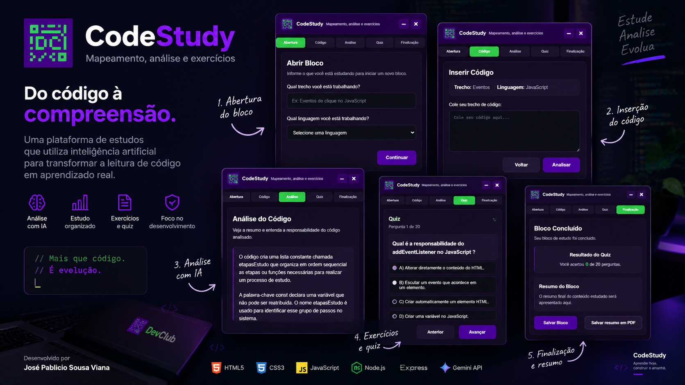

# CodeStudy AI 🚀

### Do código à compreensão.

O **CodeStudy** é uma plataforma de estudos de programação com inteligência artificial, desenvolvida para ajudar estudantes e desenvolvedores a compreender a lógica, o funcionamento e o fluxo de execução de trechos de código.

O projeto utiliza a **API do Google Gemini** para gerar análises estruturadas, apresentando resumos, explicações e o fluxo do código em uma interface moderna e intuitiva.

Mais do que desenvolver uma aplicação, o CodeStudy também representa a construção de uma **metodologia de planejamento, desenvolvimento, leitura de código, testes e documentação**.

---

## 💡 Funcionalidades

- **Análise de código com IA:** integração com a API do Gemini para gerar resumos, explicações e descrições do fluxo de execução.
- **Bloco de estudos:** interface organizada em etapas para acompanhar o processo de aprendizagem.
- **Interface moderna:** layout escuro, com janela de estudos e navegação entre etapas.
- **Integração Frontend e Backend:** comunicação entre a interface JavaScript e o servidor Node.js.
- **Proteção da chave de API:** configuração da chave do Gemini no backend por meio de variáveis de ambiente.

### 🔜 Funcionalidades planejadas

- Geração de quiz para reforçar o aprendizado.
- Armazenamento e recuperação dos blocos de estudo.
- Exportação do conteúdo estudado em PDF.

---

## 🛠️ Tecnologias Utilizadas

| Área | Tecnologias |
|---|---|
| **Frontend** | HTML5, CSS3 e JavaScript |
| **Backend** | Node.js e Express |
| **Inteligência Artificial** | Google Gemini API |
| **Comunicação** | Fetch API e HTTP |
| **Configuração** | dotenv |
| **Versionamento** | Git e GitHub |

---

## 🏗️ Arquitetura do Projeto

O CodeStudy foi organizado com separação de responsabilidades entre interface, servidor, integração com IA e documentação.

```text
CodeStudy/
│
├── frontend/
│   ├── index.html
│   ├── css/
│   └── js/
│
├── backend/
│   ├── server.js
│   ├── routes/
│   │   └── aiRoutes.js
│   ├── controllers/
│   │   └── aiController.js
│   └── .env
│
├── docs/
│
└── README.md
```

### Fluxo de comunicação

```text
Usuário
   ↓
Interface CodeStudy
   ↓
Requisição HTTP
   ↓
Servidor Express
   ↓
Controller da IA
   ↓
Gemini API
   ↓
Análise retornada à interface
```

A chave de acesso ao Gemini permanece configurada no backend, evitando sua exposição no código executado pelo navegador.

---

## 🧠 Metodologia de Desenvolvimento

O CodeStudy foi desenvolvido por meio de uma metodologia estruturada, com o objetivo de compreender cada etapa da implementação e organizar o processo de aprendizagem.

### Planejamento

**Problema → Objetivo → MVP → Roadmap → Arquitetura**

### Desenvolvimento

**Planejar → Implementar → Testar → Code Review → Refatorar → Commitar → Documentar**

Cada funcionalidade é dividida em blocos menores, com responsabilidades definidas, permitindo implementar, testar e documentar uma etapa por vez.

### Metodologia de leitura de código JavaScript

Durante o desenvolvimento, organizei a leitura do código em seis categorias:

| Categoria | Responsabilidade |
|---|---|
| **Observação** | Compreender o comportamento esperado. |
| **Seleção** | Localizar elementos e dados necessários. |
| **Escuta** | Identificar eventos e interações. |
| **Processamento** | Executar a lógica da aplicação. |
| **Condição** | Validar regras e determinar o fluxo. |
| **Atualização** | Modificar dados, estados ou elementos da interface. |

Essa metodologia permite compreender não apenas **o que o código faz**, mas também **por que ele existe e qual responsabilidade exerce na aplicação**.

---

## 📚 Documentação

A documentação faz parte do processo de desenvolvimento do CodeStudy.

Cada etapa é registrada com três pontos principais:

- **Objetivo:** o que foi planejado e implementado.
- **Desafios:** dificuldades encontradas durante o desenvolvimento.
- **Conclusão:** resultados e aprendizados da etapa.

Os registros de desenvolvimento são organizados na pasta `docs/`, enquanto o Git e o GitHub são utilizados para acompanhar a evolução do projeto por meio de commits.

---

## 🚀 Como Rodar o Projeto

### Pré-requisitos

- Node.js e npm instalados.
- Chave de API do Google Gemini.

### 1. Clone o repositório

```bash
git clone URL_DO_SEU_REPOSITORIO
cd CodeStudy
```

### 2. Instale as dependências do backend

```bash
cd backend
npm install
```

### 3. Configure a chave da API

Crie um arquivo `.env` dentro da pasta `backend` e adicione:

```env
GEMINI_API_KEY=SUA_CHAVE_AQUI
```

**Importante:** mantenha o arquivo `.env` fora do versionamento e nunca publique sua chave de API.

### 4. Inicie o servidor

```bash
node server.js
```

O servidor será iniciado na porta `3000`, conforme a configuração do projeto.

### 5. Execute o frontend

Abra o arquivo `frontend/index.html` no navegador ou utilize um servidor local.

Mantenha o backend em execução para utilizar a análise de código com IA.

---
## 🌐 Live Demo

🔗 https://pabliciosousa49-lang.github.io/Page-DevClub-Study/

## 🧪 Como Visualizar as Etapas do CodeStudy

Para explorar as diferentes telas do projeto, abra a aplicação no navegador e mantenha a janela do **CodeStudy** aberta.

Em seguida:

1. Pressione `F12` para abrir as Ferramentas do Desenvolvedor.
2. Acesse a aba **Console**.
3. Execute **um comando por vez** para visualizar a etapa desejada.

### 📝 Etapa de inserção de código

```javascript
mostrarEtapa(inserirCodigo);
```

### 🧠 Etapa do quiz

```javascript
mostrarEtapa(quiz);
```

### ✅ Etapa de finalização

```javascript
mostrarEtapa(finalizacao);
```

### 📚 Etapa de consulta do bloco

```javascript
mostrarEtapa(consultaBloco);
```

> **Observação:** esses comandos permitem navegar diretamente entre as telas para visualizar a interface durante a demonstração. Eles não executam automaticamente as funcionalidades de cada etapa.

## 📸 Preview

<p align="center">
  
</p>

> A imagem acima deve ser uma captura real da aplicação. Confira se o arquivo `CodeStudy.png` está salvo no caminho indicado.

---

## 🎯 Objetivo Profissional

O CodeStudy faz parte do meu processo de desenvolvimento como programador, permitindo aplicar conhecimentos de **Frontend, Backend, integração com APIs, arquitetura de software e documentação técnica**.

O projeto também demonstra minha abordagem de aprendizagem: utilizar a inteligência artificial como ferramenta de apoio, mantendo o foco na compreensão do código, nas decisões técnicas e no processo de desenvolvimento.

---

## 👨‍💻 Desenvolvedor

**José Pablicio Sousa Viana**

Desenvolvimento Front-End | Desenvolvimento de Software

Acadêmico de Análise e Desenvolvimento de Sistemas, com foco em desenvolvimento Full-Stack.

[LinkedIn](www.linkedin.com/in/pablicio-sousa-6554462a0) • [GitHub](https://github.com/pabliciosousa49-lang)

---

<p align="center">
  <strong>CodeStudy — Do código à compreensão.</strong>
</p>